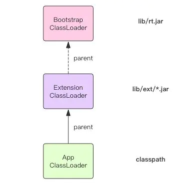

# 死磕-ClassLoader

`ClassLoader` 是 `Java` 届最为神秘的技术之一，无数人被它伤透了脑筋，摸不清门道究竟在哪里。

网上的文章也是一篇又一篇，经过本人的亲自鉴定，绝大部分内容都是在误导别人。
本文我带读者彻底吃透 ClassLoader，以后其它的相关文章你们可以不必再细看了。

## 是什么

顾名思义，它是用来加载 Class 的。它负责将 Class 的字节码形式转换成内存形式的 Class 对象。
字节码可以来自于磁盘文件 *.class，也可以是 jar 包里的 *.class，
也可以来自远程服务器提供的字节流，字节码的本质就是一个字节数组 []byte，它有特定的复杂的内部格式。


有很多字节码加密技术就是依靠定制 ClassLoader 来实现的。
先使用工具对字节码文件进行加密，运行时使用定制的 ClassLoader 先解密文件内容再加载这些解密后的字节码。

每个 Class 对象的内部都有一个 classLoader 字段来标识自己是由哪个 ClassLoader 加载的。
ClassLoader 就像一个容器，里面装了很多已经加载的 Class 对象。

```java
class Class<T> {
  // ...
  private final ClassLoader classLoader;
  // ...
}
```

## 延迟加载

**JVM 运行并不是一次性加载所需要的全部类的，它是按需加载，也就是延迟加载**。

程序在运行的过程中会逐渐遇到**很多不认识的新类**，这时候就会调用 ClassLoader 来加载这些类。
**加载完成后就会将 Class 对象存在 ClassLoader 里面，下次就不需要重新加载了**。

比如：你在调用某个类的**静态方法**时，首先这个类肯定是需要被加载的，但是并不会触及这个类的实例字段，
那么**实例字段的类别 Class 就可以暂时不必去加载**，但是它可能会**加载静态字段相关的类别**，因为静态方法会访问静态字段。
而实例字段的类别需要等到你实例化对象的时候才可能会加载。

## 特点

- JVM 运行实例中会存在多个 ClassLoader，不同的 ClassLoader 会从不同的地方加载字节码文件。
它可以从不同的文件目录加载，也可以从不同的 jar 文件中加载，也可以从网络上不同的服务地址来加载。

- **JVM 中内置了三个重要的 ClassLoader，分别是 BootstrapClassLoader、ExtensionClassLoader 和 AppClassLoader**。

- BootstrapClassLoader 负责加载 JVM 运行时核心类，这些类位于 JAVA_HOME/lib/rt.jar 文件中，
我们常用内置库 java.xxx.* 都在里面，比如 java.util.*、java.io.*、java.nio.*、java.lang.* 等等。
这个 ClassLoader 比较特殊，它是由 C 代码实现的，我们将它称之为「根加载器」。

- ExtensionClassLoader 负责加载 JVM 扩展类，比如 swing 系列、内置的 js 引擎、xml 解析器 等等，
这些库名通常以 javax 开头，它们的 jar 包位于 JAVA_HOME/lib/ext/*.jar 中，有很多 jar 包。

- AppClassLoader 才是直接面向我们用户的加载器，它会加载 Classpath 环境变量里定义的路径中的 jar 包和目录。
我们自己编写的代码以及使用的第三方 jar 包通常都是由它来加载的。

- 那些位于网络上静态文件服务器提供的 jar 包和 class文件，jdk 内置了一个 URLClassLoader，
用户只需要传递规范的网络路径给构造器，就可以使用 URLClassLoader 来加载远程类库了。
URLClassLoader 不但可以加载远程类库，还可以加载本地路径的类库，取决于构造器中不同的地址形式。
ExtensionClassLoader 和 AppClassLoader 都是 URLClassLoader 的子类，它们都是从本地文件系统里加载类库。

- AppClassLoader 可以由 ClassLoader 类提供的静态方法 getSystemClassLoader() 得到，
它就是我们所说的「系统类加载器」，我们用户平时编写的类代码通常都是由它加载的。
当我们的 main 方法执行的时候，这第一个用户类的加载器就是 AppClassLoader。

# ClassLoader 传递性

程序在运行过程中，遇到了一个未知的类，**它会选择哪个 ClassLoader 来加载它呢**？

虚拟机的策略是使用调**用者 Class 对象的 ClassLoader 来加载当前未知的类**。
何为调用者 Class 对象？就是在遇到这个未知的类时，虚拟机肯定正在运行一个方法调用（静态方法或者实例方法），
这个方法挂在哪个类上面，那这个类就是调用者 Class 对象。
前面我们提到每个 Class 对象里面都有一个 classLoader 属性记录了当前的类是由谁来加载的。

因为 ClassLoader 的传递性，**所有延迟加载的类都会由初始调用 main 方法的这个 ClassLoader 全全负责**，它就是 AppClassLoader。

## 双亲委派

前面我们提到 AppClassLoader 只负责加载 Classpath 下面的类库，如果遇到没有加载的系统类库怎么办?

AppClassLoader 必须将系统类库的加载工作交给 BootstrapClassLoader 和 ExtensionClassLoader 来做，这就是我们常说的「双亲委派」。



说明：

- AppClassLoader 在加载一个未知的类名时，它并不是立即去搜寻 Classpath，它会首先将这个类名称交给 ExtensionClassLoader 来加载，
如果 ExtensionClassLoader 可以加载，那么 AppClassLoader 就不用麻烦了。否则它就会搜索 Classpath 。

- ExtensionClassLoader 在加载一个未知的类名时，它也并不是立即搜寻 ext 路径，它会首先将类名称交给 BootstrapClassLoader 来加载，
如果 BootstrapClassLoader 可以加载，那么 ExtensionClassLoader 也就不用麻烦了。否则它就会搜索 ext 路径下的 jar 包。

- 这三个 ClassLoader 之间形成了级联的父子关系，每个 ClassLoader 都很懒，尽量把工作交给父亲做，父亲干不了了自己才会干。
每个 ClassLoader 对象内部都会有一个 parent 属性指向它的父加载器。

```java
class ClassLoader {
  // ...
  private final ClassLoader parent;
  // ...
}
```

值得注意的是图中的 ExtensionClassLoader 的 parent 指针画了虚线，这是因为它的 parent 的值是 null，
**当 parent 字段是 null 时就表示它的父加载器是「根加载器」**。
如果某个 Class 对象的 classLoader 属性值是 null，那么就表示这个类也是「根加载器」加载的。

## Class.forName

当我们在使用 jdbc 驱动时，经常会使用 Class.forName 方法来动态加载驱动类。

```java
Class.forName("com.mysql.cj.jdbc.Driver");
```

其原理是 mysql 驱动的 Driver 类里有一个静态代码块，它会在 Driver 类被加载的时候执行。
这个静态代码块会将 mysql 驱动实例注册到全局的 jdbc 驱动管理器里。

```java
class Driver {
  static {
    try {
       java.sql.DriverManager.registerDriver(new Driver());
    } catch (SQLException E) {
       throw new RuntimeException("Can't register driver!");
    }
  }
  // ...
}
```

forName 方法同样也是使用调用者 Class 对象的 ClassLoader 来加载目标类。
不过 forName 还提供了多参数版本，可以指定使用哪个 ClassLoader 来加载

```java
Class<?> forName(String name, boolean initialize, ClassLoader cl)
```

通过这种形式的 forName 方法可以突破内置加载器的限制，通过使用自定类加载器允许我们自由加载其它任意来源的类库。
根据 ClassLoader 的传递性，目标类库传递引用到的其它类库也将会使用自定义加载器加载。

## 自定义加载器

ClassLoader 里面有**三个重要的方法** loadClass()、findClass() 和 defineClass()。
loadClass() 方法是加载目标类的入口，它首先会查找当前 ClassLoader 以及它的双亲里面是否已经加载了目标类，
如果没有找到就会让双亲尝试加载，如果双亲都加载不了，就会调用 findClass() 让自定义加载器自己来加载目标类。
ClassLoader 的 findClass() 方法是需要子类来覆盖的，不同的加载器将使用不同的逻辑来获取目标类的字节码。
拿到这个字节码之后再调用 defineClass() 方法将字节码转换成 Class 对象。下面我使用伪代码表示一下基本过程

```java
class ClassLoader {
  // 加载入口，定义了双亲委派规则
  Class loadClass(String name) {
    // 是否已经加载了
    Class t = this.findFromLoaded(name);
    if(t == null) {
      // 交给双亲
      t = this.parent.loadClass(name)
    }
    if(t == null) {
      // 双亲都不行，只能靠自己了
      t = this.findClass(name);
    }
    return t;
  }

  // 交给子类自己去实现
  Class findClass(String name) {
    throw ClassNotFoundException();
  }

  // 组装Class对象
  Class defineClass(byte[] code, String name) {
    return buildClassFromCode(code, name);
  }
}

class CustomClassLoader extends ClassLoader {

  Class findClass(String name) {
    // 寻找字节码
    byte[] code = findCodeFromSomewhere(name);
    // 组装Class对象
    return this.defineClass(code, name);
  }
}
```

自定义类加载器不易破坏双亲委派规则，不要轻易覆盖 loadClass 方法。否则可能会导致自定义加载器无法加载内置的核心类库。
在使用自定义加载器时，要明确好它的父加载器是谁，将父加载器通过子类的构造器传入。
如果父类加载器是 null，那就表示父加载器是「根加载器」。

```java
// ClassLoader 构造器
protected ClassLoader(String name, ClassLoader parent);
```

双亲委派规则可能会变成三亲委派，四亲委派，取决于你使用的父加载器是谁，它会一直递归委派到根加载器。

## 彩蛋

